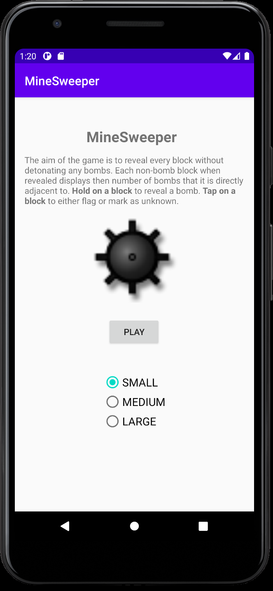

# kotlin-minesweeper-basics
Basic implementation of Minesweeper in Kotlin on Android Studio. 
Mainly developed to help understand kotlin (although probably should have used more of the language's semantics) and android app development in general.

